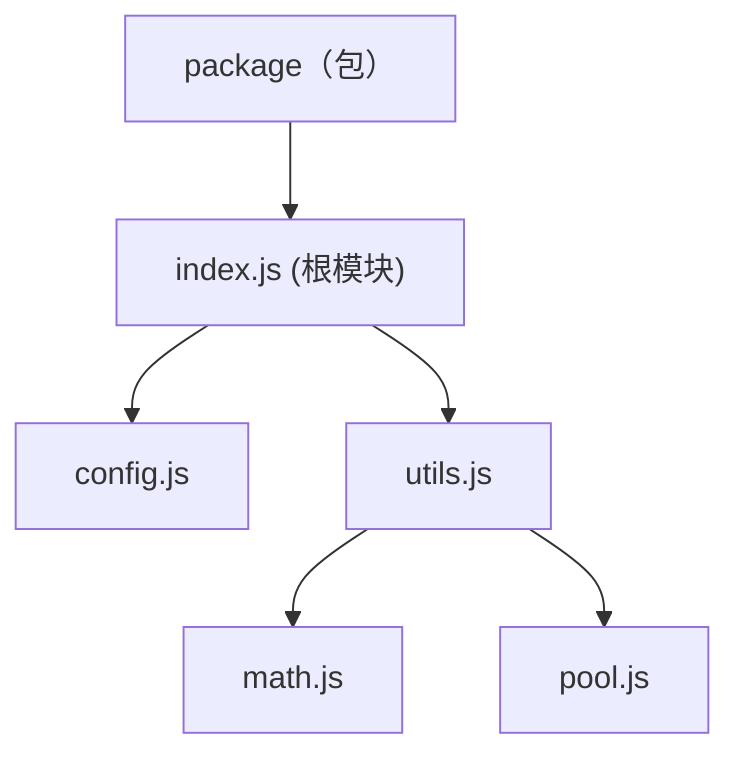

# Module Organization Standard（MOS）

## 简介

这是一种 ECMAScript Module 的组织规范，目标是统一 ECMAScript 模块和包的组织结构，并且提供自动化工具简化操作。

当前规范主要关注以下几点：

- 模块、值的可见性
- 严格包结构

## 规范

> 提示：
> - ECMAScript Module 规定每个文件都是一个模块。
> - MeoDoc 规定带有 `@module` 标记的文档注释视为模块级别注释。
> - 包机制即诸如 `Npm Package` 这样的将多个模块视为一个包的规范。

### 模块树

使用 `export` 导出模块时，导出语句所在的模块和被导出模块互称父模块与子模块。

通过包机制直接公开的模块称为根模块。

例如以下 `Npm Package` 的结构：

`package.json`
```json
{
    "exports": "src/index.js"
}
```

`src/index.js`
```js
/**
 * This is a useful demonstration module.
 * 
 * @public
 * @module
 */

export * from "./config.js";
export * from "./utils.js";
```

`src/utils.js`
```js
export * from "./math.js";
export * from "./pool.js";
```

对应的模块树为：



需注意的是，若包机制支持子路径导出，那么可能不止有一个根模块。

### 模块可见性

在注释中使用以下标记来声明模块的可见性：

- `@public` - 公开模块，可被其它包访问
- `@internal` - 私有模块，不允许被其它包访问
- `@inherit` - 普通模块，可见性取决于父模块，可通过公开的父模块被访问。

无任何可见性标记的情况下，模块默认会被视为用 `@inherit` 标记，不推荐显式添加此标记。

注意:

- 根模块必须为显式的公开模块，即用 `@public` 标记。
- 公开模块的子模块可以被访问，所以不允许导出具有 `@internal` 标记的模块。

一个公开模块可以像这样声明：

`src/index.js`
```js
/**
 * This is a useful demonstration module.
 * 
 * @public
 * @module
 */

/**
 * Example Class
 */
export class Example { ... }
```

### 值的可见性

默认情况下，值仅在模块内可见。

`index.js`
```js
const value = 1;
```

使用 `export` 可以导出值，即将值完全公开，可通过值所在的模块访问到该值。

`index.js`
```js
export const value = 1;
```

如果不想值被其它包访问，可以添加 `@internal` 标记，则该值仅在包范围内公开。

`index.js`
```js
/**
 * @internal
 */
export const value = 1;
```

### 严格包结构

本章描述一种严格的包结构，该规范皆在提高包的可维护性，并提供对自动化生成工具的支持。

#### 根目录规范

需指定一个目录为源码的根目录，模块树基于该目录进行构建。

推荐使用 `src` 目录作为根目录，例如：

```
package/
├── src/
│   └── index.js
└── package.json
```

#### 根模块规范

所有公开模块都会视为根模块，需在包机制中进行导出。

包机制如果有子路径功能，则支持有多个根模块（公开模块），例如：

```
package/
├── src/
│   ├── tools/
│   │   ├── math.js - `@public`
│   │   └── c4.js
│   ├── utils.js - `@public`
│   └── index.js - `@public`
└── package.json
```

对应的 `package.json` 导出是：

```json
{
    "exports": {
        ".": "src/index.js",
        "./utils": "src/utils.js",
        "./tools/math": "src/tools/math.js"
    }
}
```

如果包机制没有子路径导出的功能，则不允许存在多个根模块（公开模块）。

#### 子路径规范

默认情况下，需以模块本身相对于根目录且去掉文件扩展名的路径作为导出子路径，例如：

- `src/tools/math.js` -> `./tools/math`
- `src/utils.js` -> `./utils`

若需要定义为其它路径，则需添加 `@modulePath` 标记，例如：

`src/tools/math.js`
```js
/**
 * This is a useful demonstration module.
 * 
 * @public
 * @module
 * @modulePath ./math
 */

/**
 * Example Class
 */
export class Example { ... }
```

这样 `src/tools/math.js` 的子路径就被定义为 `./math`。

#### index 文件规范

文件名为 `index` 的模块会被特殊处理，视为在上级目录中的一个模块，名称是所在目录的名称。

例如：

- `src/tools/index.js` 的默认子路径是 `./tools`
- `src/index.js` 的默认子路径是 `.`

所以如果存在路径为 `src/tools.js` 的模块，就不允许存在路径为 `src/tools/index.js` 的模块，这两个模块路径会发生冲突。

#### 模块树规范

