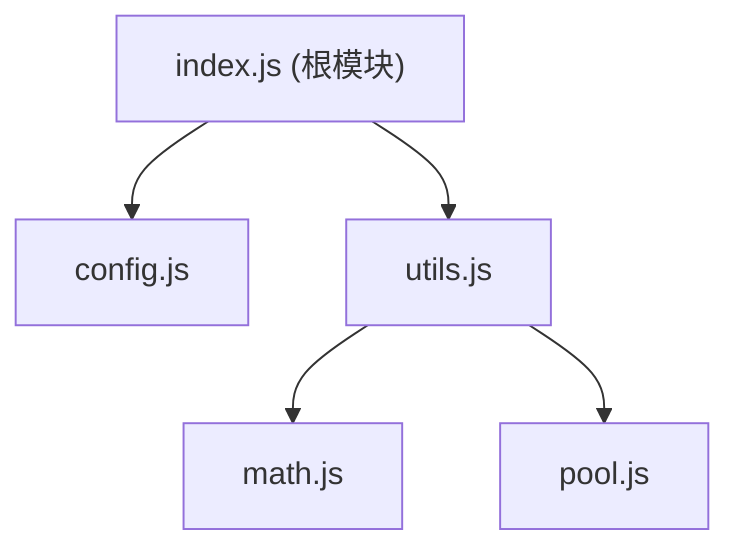

# Module Organization Standard（MOS）

## 简介

这是一种 ECMAScript Module 的组织规范，目标是统一 ECMAScript 模块和包的组织结构，并且提供自动化工具简化操作。

当前规范主要关注以下几点：

- 模块、值的可见性
- 严格包结构

## 规范

> 提示：
> - ECMAScript Module 规定每个文件都是一个模块。
> - MeoDoc 规定带有 `@module` 标记的文档注释视为模块级别注释。
> - 包机制即诸如 `Npm Package` 这样的将多个模块视为一个包的规范。

### 模块树

使用 `export` 导出模块时，导出语句所在的模块和被导出模块互称父模块与子模块。

通过包机制直接公开的模块称为根模块。

例如以下 `Npm Package` 的结构：

`package.json`
```json
{
    "exports": "src/index.js"
}
```

`src/index.js`
```js
/**
 * This is a useful demonstration module.
 * 
 * @module
 * @public
 */

export * from "./config.js";
export * from "./utils.js";
```

`src/utils.js`
```js
export * from "./math.js";
export * from "./pool.js";
```

对应的模块树为：



### 模块可见性

在注释中使用以下标记来声明模块的可见性：

- `@public` - 公开模块，可被其它包访问
- `@internal` - 私有模块，不允许被其它包访问
- `@inherit` - 普通模块，可见性取决于父模块，可通过公开的父模块被访问。

无任何可见性标记的情况下，模块默认会被视为用 `@inherit` 标记，不推荐显式添加此标记。

注意:

- 根模块必须为显式的公开模块，即用 `@public` 标记。
- 公开模块的子模块可以被访问，所以不允许导出具有 `@internal` 标记的模块。

一个公开模块可以像这样声明：

`src/index.js`
```js
/**
 * This is a useful demonstration module.
 * 
 * @module
 * @public
 */

/**
 * Example Class
 */
export class Example { ... }
```

### 值的可见性

默认情况下，值仅在模块内可见。

`index.js`
```js
const value = 1;
```

使用 `export` 可以导出值，即将值完全公开，可通过值所在的模块访问到该值。

`index.js`
```js
export const value = 1;
```

如果不想值被其它包访问，可以添加 `@internal` 标记，则该值仅在包范围内公开。

`index.js`
```js
/**
 * @internal
 */
export const value = 1;
```

### 严格包结构

本章描述一种严格的包结构，该规范皆在提高包的可维护性，并提供对自动化生成工具的支持。

#### 源码根目录

需指定一个目录为源码的根目录，模块树基于该目录进行构建。

推荐使用 `src` 目录作为根目录，例如：

```
package/
├── src/
│   └── index.js
└── package.json
```

#### 公开模块即根模块

即将每个公开模块都视为根模块，需要在包机制中导出。

如果包机制没有子路径导出的功能，则不允许有多个根模块，如果有的话则支持嵌套根模块，比如：

```
package/
├── src/
│   ├── tools/
│   │   ├── math.js - `@public`
│   │   └── c4.js
│   ├── utils.js - `@public`
│   └── index.js - `@public`
└── package.json
```

对应的 `package.json` 导出是：

```json
{
    "exports": {
        ".": "src/index.js",
        "./utils": "src/utils.js",
        "./tools/math": "src/tools/math.js"
    }
}
```

#### 根模块子路径

推荐以模块相对于根目录切去掉文件扩展名的路径作为导出子路径，例如：

- `src/tools/math.js` -> `./tools/math`
- `src/utils.js` -> `./utils`

如果不是以此对应，请


根模块默认情况下对应着与导出子路径对应的子路径

#### `index`

文件名为 `index` 的模块会被特殊处理，

#### 
