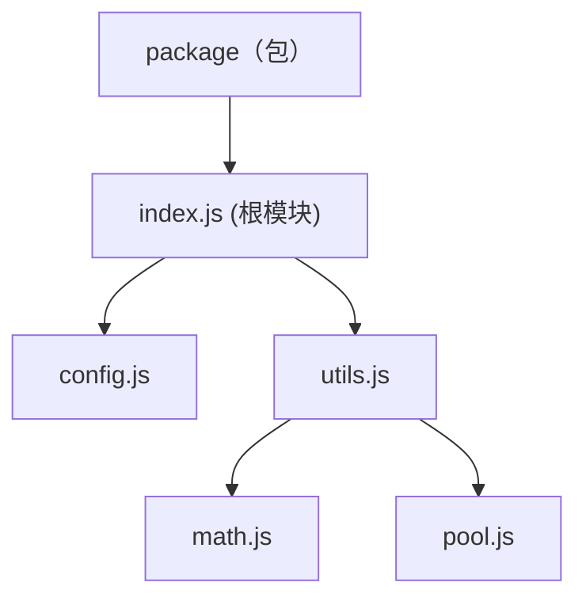
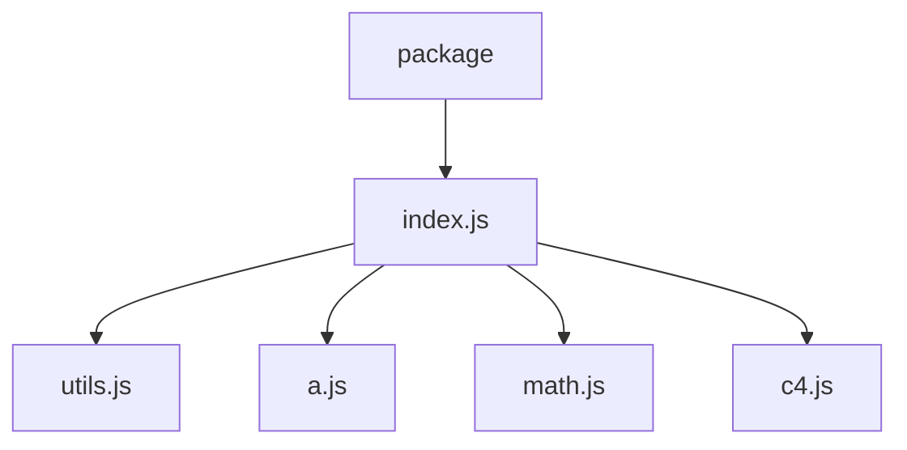
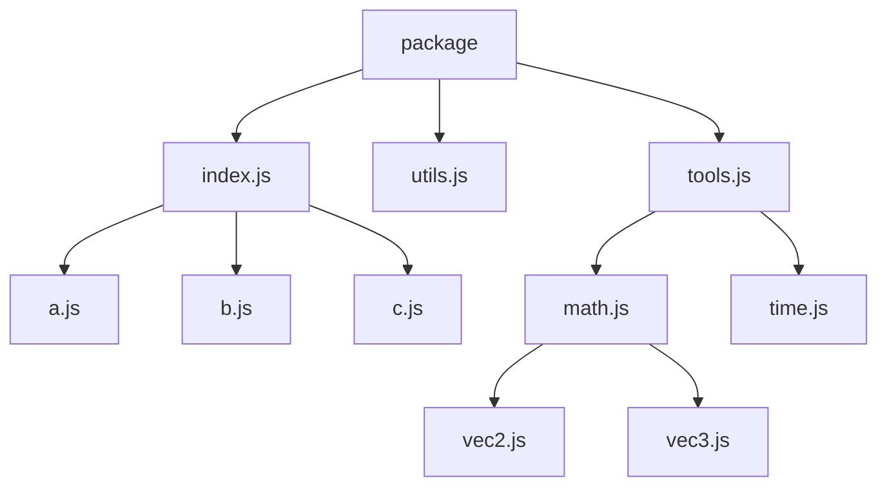

# ECMAScript Package Standard

## 简介

该标准尝试规范化由多个 ECMAScript Module 组成一个 Package 的方法，除了规则的简单、一致、可维护性之外，也同样会保证对自动化工具的良好支持。

## 引用

- ECMAScript Module 规定每个文件都是一个模块。
- MeoDoc 规定带有 `@module` 标记的文档注释视为模块级别注释。
- 比如 `Npm Package` 这样将多模块组成单个包的约定称为包机制。

## 模块可见性

在注释中使用以下标记来声明模块的可见性：

- `@public` - 公开模块，可被其它包访问。
- `@internal` - 私有模块，不允许被其它包访问。
- `@inherit` - 普通模块，可见性取决于父模块，可通过公开的父模块被访问。

无任何可见性标记的情况下，模块默认会被视为用 `@inherit` 标记，不推荐显式添加此标记。

注意:

- 根模块必须为显式的公开模块，即用 `@public` 标记。
- 公开模块的子模块可以被访问，所以不允许导出具有 `@internal` 标记的模块。

一个公开模块可以像这样声明：

`src/index.js`
```js
/**
 * This is a useful demonstration module.
 * 
 * @public
 * @module
 */

/**
 * Example Class
 */
export class Example { ... }
```

## 值的可见性

默认情况下，值仅在模块内可见。

`index.js`
```js
const value = 1;
```

使用 `export` 可以导出值，即将值完全公开，可通过值所在的模块访问到该值。

`index.js`
```js
export const value = 1;
```

如果不想值被其它包访问，可以添加 `@internal` 标记，则该值被声明为私有值，仅在包范围内公开。

`index.js`
```js
/**
 * @internal
 */
export const value = 1;
```

## 推荐包结构

本章描述一种推荐的包结构的组织方式，皆在提高可维护性，并提供对自动化生成工具的支持。

### 概念

使用 `export` 导出模块时，导出语句所在的模块和被导出模块互称父模块与子模块。

通过包机制直接导出的模块称为根模块。

例如以下 `Npm Package` 的结构：

`package.json`
```json
{
    "exports": "src/index.js"
}
```

`src/index.js`
```js
/**
 * This is a useful demonstration module.
 * 
 * @public
 * @module
 */

export * from "./config.js";
export * from "./utils.js";
```

`src/utils.js`
```js
export * from "./math.js";
export * from "./pool.js";
```

对应的包结构为：



需注意的是，若包机制支持子路径导出，那么可能不止有一个根模块。

### 根目录

需指定一个目录为源码的根目录，包结构基于该目录进行构建。

推荐使用 `src` 目录作为根目录，例如：

```
package/
├── src/
│   └── index.js
└── package.json
```

### 根模块

所有公开模块都会视为根模块，需在包机制中进行导出。

包机制如果有子路径功能，则支持有多个根模块（公开模块），例如：

```
package/
├── src/
│   ├── tools/
│   │   ├── math.js - `@public`
│   │   └── c4.js
│   ├── utils.js    - `@public`
│   └── index.js    - `@public`
└── package.json
```

对应的 `package.json` 导出是：

```json
{
    "exports": {
        ".": "src/index.js",
        "./utils": "src/utils.js",
        "./tools/math": "src/tools/math.js"
    }
}
```

如果包机制没有子路径导出的功能，则不允许存在多个根模块（公开模块）。

### 子路径

默认情况下，需以模块本身相对于根目录且去掉文件扩展名的路径作为导出子路径，例如：

- `src/tools/math.js` -> `./tools/math`
- `src/utils.js` -> `./utils`

若需要定义为其它路径，则需添加 `@modulePath` 标记，例如：

`src/tools/math.js`
```js
/**
 * This is a useful demonstration module.
 * 
 * @public
 * @module
 * @modulePath ./math
 */

/**
 * Example Class
 */
export class Example { ... }
```

这样 `src/tools/math.js` 的子路径就被定义为 `./math`。

### 入口模块

被命名为 `index` 的文件称为该模块所在目录的入口模块。

例如 `src/index.js` 是 `src` 目录的入口模块。

如果模块在同级有一个相同名称的子目录，则称为该目录的入口模块。

例如 `src/utils.js` 是 `src/utils/` 目录的入口模块。

子路径的生成会遵循该规范，例如：

- `src/utils.js` 的默认子路径是 `./utils`。
- `src/tools/index.js` 的默认子路径是 `./tools`。
- `src/index.js` 的默认子路径是 `.`。

同个目录不允许存在多个入口模块。

例如存在路径为 `src/tools.js` 的模块，就不允许存在路径为 `src/tools/index.js` 的模块。

### 特殊模块标识符

工具可以提供对以下特殊模块标识符的支持：

#### `!sub-modules`

当模块是入口模块时可用，该标识符指代该入口模块对应的目录内的所有模块。

例如，包的文件树结构为：

```
package/
├── src/
│   ├── tools/
│   │   ├── math.js
│   │   └── c4.js
│   ├── utils.js
│   ├── a.js
│   └── index.js    - `@public`
└── package.json
```

并且 `index.js` 模块有 `export * from "!sub-modules"` 导出语句。

上面的文件树中只有一个 `src` 目录的入口模块 `src/index.js`，所以所有在 `src` 目录中的模块都将作为它的子模块，而它也作为根模块构成这样的包结构：



需要注意：

- 如果目录中有其它入口模块，则仅会将入口模块本身作为子模块。
- 如果目录中有其它根模块，则会直接忽略该模块本身和目录。
- 如果模块或者值是私有的，那么会直接被忽略。

举一个比较复杂的例子：

```
package/
├── src/
│   ├── tools/
│   │   ├── math/
│   │   │   ├── vec2.js
│   │   │   └── vec3.js
│   │   ├── math.js
│   │   └── time.js
│   ├── tools.js    - `@public`
│   ├── others/
│   │   ├── b.js
│   │   └── c.js
│   ├── utils.js    - `@public`
│   ├── a.js
│   └── index.js    - `@public`
└── package.json
```

如果所有入口模块都使用了 `!sub-modules` 导出子模块，那么对应地将映射成这样的包结构：



### 特殊文档注释标记

#### `@moduleTag` & `@tag`

模块默认情况下带有 `default` 标签，相当于以下声明：

```js
/**
 * This is a useful demonstration module.
 * 
 * @public
 * @module
 * @moduleTag default
 */
```

每个导出的值默认情况下带有所属模块的标签，相当于以下声明：

```js
/**
 * This is a useful demonstration module.
 * 
 * @public
 * @module
 * @moduleTag default
 */

/**
 * @tag default
 */
export const value = 1;
```

你可以通过添加 `@moduleTag` 来指定模块的标签，通过 `@tag` 来指定值的标签：

```js
/**
 * This is a useful demonstration module.
 * 
 * @public
 * @module
 * @moduleTag utils
 */

/**
 * @tag hooks
 */
export const value = 1;
```

当工具自动生成导出时，应只生成带有 `default` 标签值的导出，并提供方法导出指定标签的值。

比如以这样的方式将所有带 `symbol` 标签的值聚合导出为 `Symbol`：

```js
// #export tag:symbol as Symbol from "**/*.js"
```
