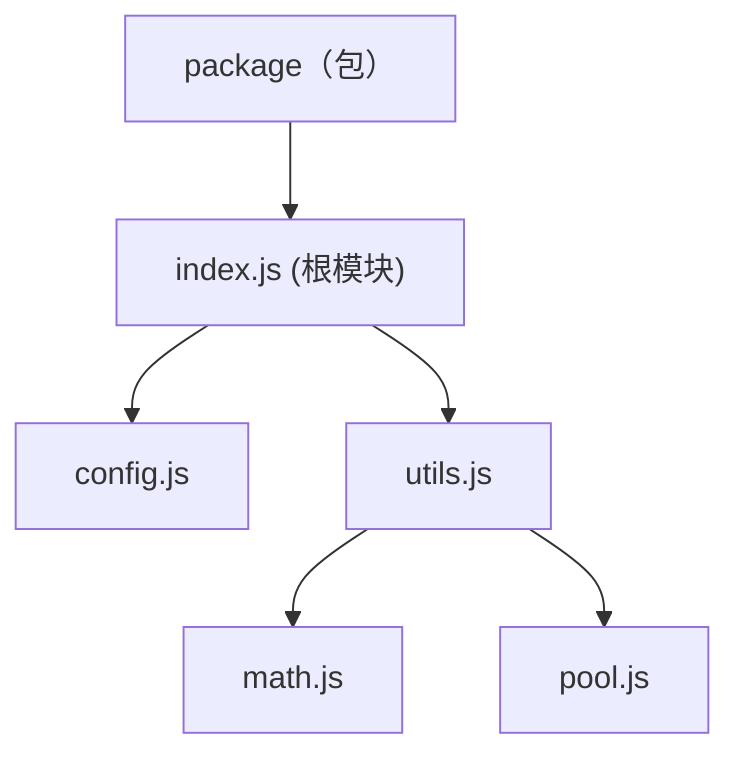
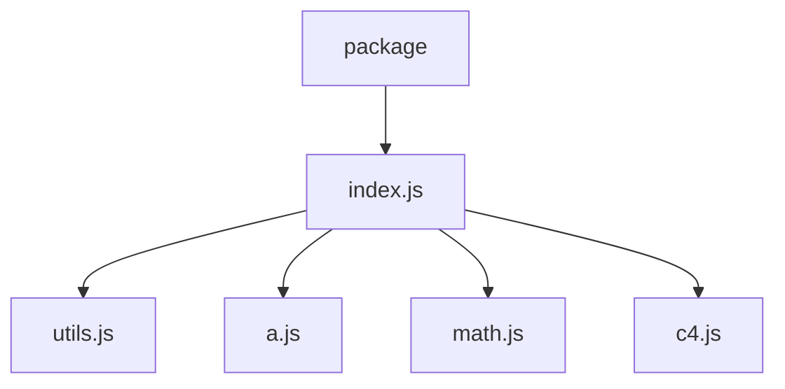
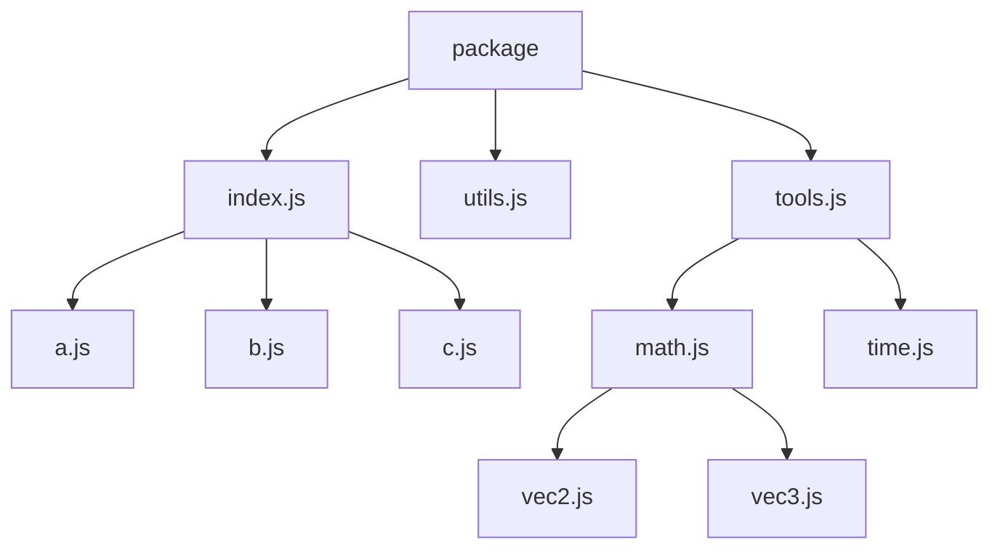

# ECMAScript Package Standard

## 简介

该标准尝试规范化由多个 ECMAScript Module 组成一个 Package 的方法，除了规则的简单、一致、可维护性之外，也同样会保证对自动化工具的良好支持。

## 引用

- ECMAScript Module 规定每个文件都是一个模块。
- MeoDoc 规定带有 `@module` 标记的文档注释视为模块级别注释。
- 比如 `Npm Package` 这样将多模块组成单个包的约定称为包机制。

## 模块可见性

在注释中使用以下标记来声明模块的可见性：

- `@public` - 公开模块，可被其它包访问。
- `@internal` - 私有模块，不允许被其它包访问。
- `@inherit` - 普通模块，可见性取决于父模块，可通过公开的父模块被访问。

无任何可见性标记的情况下，模块默认会被视为用 `@inherit` 标记，不推荐显式添加此标记。

一个公开模块可以像这样声明：

`src/index.js`

```js
/**
 * This is a useful demonstration module.
 *
 * @public
 * @module
 */

/**
 * Example Class
 */
export class Example { ... }
```

## 值的可见性

默认情况下，值仅在模块内可见。

`index.js`

```js
const value = 1;
```

使用 `export` 可以导出值，即将值完全公开，可通过值所在的模块访问到该值。

`index.js`

```js
export const value = 1;
```

如果不想值被其它包访问，可以添加 `@internal` 标记，则该值被声明为私有值，仅在包范围内公开。

`index.js`

```js
/**
 * @internal
 */
export const value = 1;
```

## 二进制模块

有些包机制允许你将模块声明为二进制模块，使其成为可执行命令。

二进制模块需要在文档注释中添加 `@bin` 标记，例如：

`bin.js`

```js
/**
 * This is a bin entrypoint.
 *
 * @bin
 */
```

标记值一般作为该二进制模块的可执行命令名称，如果包机制存在默认名称的规范，那么标签值可以省略。

`@bin` 标记可以和 `@module` 等其它标记混用，且可以同时存在多个不同标记值的 `@bin` 标记。

构建工具可以检查此标记以自动生成包机制所需的声明，例如 `Npm Package`：

`package.json`

```json
{
  "bin": "./dist/bin.js"
}
```

如果包名是 `cli`，那么以下模块：

`cli.js`

```js
/**
 * This is a bin entrypoint.
 *
 * @bin
 * @bin build
 */
```

相对应地会生成：

`package.json`

```json
{
  "bin": {
    "cli": "./dist/bin.js",
    "build": "./dist/bin.js"
  }
}
```

## 推荐包结构

本章描述一种推荐的包结构的组织方式，皆在提高可维护性，并提供对自动化生成工具的支持。

### 概念

使用 `export` 导出模块时，导出语句所在的模块和被导出模块互称父模块与子模块。

通过包机制直接导出的模块称为根模块。

例如以下 `Npm Package` 的结构：

`package.json`

```json
{
  "exports": "src/index.js"
}
```

`src/index.js`

```js
/**
 * This is a useful demonstration module.
 *
 * @public
 * @module
 */

export * from './config.js';
export * from './utils.js';
```

`src/utils.js`

```js
export * from './math.js';
export * from './pool.js';
```

对应的包结构为：



需注意的是，若包机制支持子路径导出，那么可能不止有一个根模块。

### 根目录

需指定一个目录为源码的根目录，包结构基于该目录进行构建。

推荐使用 `src` 目录作为根目录，例如：

```
package/
├── src/
│   └── index.js
└── package.json
```

### 根模块

所有公开模块都会视为根模块，需在包机制中进行导出。

包机制如果有子路径功能，则支持有多个根模块（公开模块），例如：

```
package/
├── src/
│   ├── tools/
│   │   ├── math.js - `@public`
│   │   └── c4.js
│   ├── utils.js    - `@public`
│   └── index.js    - `@public`
└── package.json
```

对应的 `package.json` 导出是：

```json
{
  "exports": {
    ".": "src/index.js",
    "./utils": "src/utils.js",
    "./tools/math": "src/tools/math.js"
  }
}
```

### 子路径

默认情况下，需以模块本身相对于根目录且去掉文件扩展名的路径作为导出子路径，例如：

- `src/tools/math.js` -> `./tools/math`
- `src/utils.js` -> `./utils`

若需要定义为其它路径，则需添加 `@modulePath` 标记，例如：

`src/tools/math.js`

```js
/**
 * This is a useful demonstration module.
 *
 * @public
 * @module
 * @modulePath ./math
 */

/**
 * Example Class
 */
export class Example { ... }
```

这样 `src/tools/math.js` 的子路径就被定义为 `./math`。

### 入口模块

被命名为 `index` 的文件称为该模块所在目录的入口模块。

例如 `src/index.js` 是 `src` 目录的入口模块。

如果模块在同级有一个相同名称的子目录，则称为该目录的入口模块。

例如 `src/utils.js` 是 `src/utils/` 目录的入口模块。

子路径的生成会遵循该规范，例如：

- `src/utils.js` 的默认子路径是 `./utils`。
- `src/tools/index.js` 的默认子路径是 `./tools`。
- `src/index.js` 的默认子路径是 `.`。

同个目录不允许存在多个入口模块。

例如存在路径为 `src/tools.js` 的模块，就不允许存在路径为 `src/tools/index.js` 的模块。

### 特殊模块标识符

工具可以提供对以下特殊模块标识符的支持：

#### `!sub-modules`

当模块是入口模块时可用，该标识符指代该入口模块对应的目录内的所有模块。

例如，包的文件树结构为：

```
package/
├── src/
│   ├── tools/
│   │   ├── math.js
│   │   └── c4.js
│   ├── utils.js
│   ├── a.js
│   └── index.js    - `@public`
└── package.json
```

并且 `index.js` 模块有 `export * from "!sub-modules"` 导出语句。

上面的文件树中只有一个 `src` 目录的入口模块 `src/index.js`，所以所有在 `src` 目录中的模块都将作为它的子模块，而它也作为根模块构成这样的包结构：



需要注意：

- 子目录若存在入口模块，则只包含入口模块本身，不包含子目录。
- 不包含目录中的其它根模块，若它同时是入口模块，那么也不包含其对应的目录。
- 不包含私有模块或值。

举一个比较复杂的例子：

```
package/
├── src/
│   ├── tools/
│   │   ├── math/
│   │   │   ├── vec2.js
│   │   │   └── vec3.js
│   │   ├── math.js
│   │   └── time.js
│   ├── tools.js    - `@public`
│   ├── others/
│   │   ├── b.js
│   │   └── c.js
│   ├── utils.js    - `@public`
│   ├── a.js
│   └── index.js    - `@public`
└── package.json
```

如果所有入口模块都使用了 `!sub-modules` 导出子模块，那么对应地将映射成这样的包结构：



### 特殊文档注释标记

#### `@moduleTag` & `@tag`

模块默认情况下带有 `default` 标签，相当于以下声明：

```js
/**
 * This is a useful demonstration module.
 *
 * @public
 * @module
 * @moduleTag default
 */
```

每个导出的值默认情况下带有所属模块的标签，相当于以下声明：

```js
/**
 * This is a useful demonstration module.
 *
 * @public
 * @module
 * @moduleTag default
 */

/**
 * @tag default
 */
export const value = 1;
```

你可以通过添加 `@moduleTag` 来指定模块的标签，通过 `@tag` 来指定值的标签：

```js
/**
 * This is a useful demonstration module.
 *
 * @public
 * @module
 * @moduleTag utils
 */

/**
 * @tag hooks
 */
export const value = 1;
```

当工具自动生成导出时，应只生成带有 `default` 标签值的导出，并提供方法导出指定标签的值。

比如以这样的方式将所有带 `symbol` 标签的值聚合导出为 `Symbol`：

```js
// #export tag:symbol as Symbol from "**/*.js"
```

## 条件构建支持

本章描述一种推荐的条件构建的组织方式，皆在提高可维护性，并提供对自动化生成工具的支持。

你可以使用该方式实现：

- 对不同环境、平台的支持。
- 编译常量或标志。

### 配置

如果使用构建工具自动化生成，则可以增加一个配置项用于声明所有的条件，例如：

```js
{
  conditions: [
    'cocos',
    'node',
    'node-addons',
    'default',
  ],
}
```

也支持声明多组条件，多组条件需要传入一个对象，键为组名，值为条件数组：

```js
{
  conditions: {
    env: [
      'cocos',
      'node',
      'node-addons',
      'default',
    ],
    platform: [
      'ios',
      'android',
      'default',
    ],
  }
}
```

- 每个条件组应该有不同的名称。
- 每个条件应该有不同的名称，除了 `default` 这个规范确定的回退条件名称。
- 每个组只有一个条件处于开启状态。

### 条件常量

推荐将条件常量统一放在源码根目录中名称为 `compile-constant` 的模块文件中。

如果是构建工具，由于已经有了相应的配置声明，所以应该自动生成该文件；可增加一个配置让开发者指定模块的路径，使用上面的推荐路径作为默认值。

以上面单组条件示例如下：

```ts
// #region Generated compile constants
declare module 'compile-constant' {
  export const COCOS: boolean;
  export const NODE: boolean;
  export const NODE_ADDONS: boolean;
  export const DEFAULT: boolean;
}
// #endregion
```

多组条件示例如下：

`src/compile-constant.d.ts`

```ts
// #region Generated compile constants
declare module 'compile-constant/env' {
  export const COCOS: boolean;
  export const NODE: boolean;
  export const NODE_ADDONS: boolean;
  export const DEFAULT: boolean;
}

declare module 'compile-constant/platform' {
  export const IOS: boolean;
  export const ANDROID: boolean;
}
// #endregion
```

不一定要生成相同的形式，只需要让开发者可以访问到每个条件即可。

### 条件导出

应提供机制使包能够在不同条件下被外部导入。

以 `Npm Package` 举例，上面单组条件示例如下：

`package.json`

```json
{
  "exports": {
    "cocos": "./dist/cocos/index.js",
    "node": "./dist/node/index.js",
    "node-addons": "./dist/node-addons/index.js",
    "default": "./dist/default/index.js"
}
```

多组条件示例如下：

`package.json`

```json
{
  "exports": {
    "cocos": {
      "ios": "./dist/cocos/ios/index.js",
      "android": "./dist/cocos/android/index.js",
      "default": "./dist/cocos/default/index.js"
    },
    "node": {
      "ios": "./dist/node/ios/index.js",
      "android": "./dist/node/android/index.js",
      "default": "./dist/node/default/index.js"
    },
    "node-addons": {
      "ios": "./dist/node-addons/ios/index.js",
      "android": "./dist/node-addons/android/index.js",
      "default": "./dist/node-addons/default/index.js"
    },
    "default": {
      "ios": "./dist/default/ios/index.js",
      "android": "./dist/default/android/index.js",
      "default": "./dist/default/default/index.js"
    }
}
```

这样外部就可以根据不同的条件导入相应的代码了。

如果使用构建工具，那么工具应该遍历所有条件组并逐个开启条件来编译源码，例如 `./dist/node-addons/default/index.js` 应该是在开启 `env` 组的 `node-addons` 条件，和没有开启 `platform` 组任何条件下编译 `./src/index.ts` 模块的产物。

### 条件导入

在包的内部，可以使用 [条件常量](#条件常量) 来实现不同条件执行不同的代码；但有时候同模块在不同条件下的实现差别很大，这时候用单独的文件来实现会更具可维护性。

有以下两种方法做到这一点。

#### 重定向导入

重定向导入即在不同条件下将导入文件的路径重写为其它文件。

例如 `module.ts` -> `module.ios.ts`。

这通常需要构建工具实现，某些构建工具有 `resolve.extension` 或 `resolve.extensionAlias` 选项，TypeScript 有 `moduleSuffixes` 选项。

如果是多组条件，可能会类似 `module.ts` -> `module.cocos.ios.ts` 这样。

当存在多个条件组时，应将每种组合都考虑在内，并优先选择最具体的条件。

例如 `tsconfig.json` 可配置为：

```json
{
  "compilerOptions": {
    "moduleSuffixes": [".ios.cocos", ".cocos.ios", ".ios"]
  }
}
```

TypeScript 会按顺序尝试每个后缀，直到找到匹配的文件。

多个条件在后缀的顺序应视项目而定，像上面的配置允许开发者使用任意顺序的后缀。

#### 别名导入

某些包机制内置别名导入的机制，例如 `Npm Package` 允许使用 `imports` 字段来定义别名导入。

```json
{
  "imports": {
    "#utils.js": {
      "ios": "./src/utils.ios.js",
      "android": "./src/utils.android.js",
      "default": "./src/utils.default.js"
    }
  }
}
```

这样可以通过 `import { something } from '#utils.js'` 的方式来自动导入相应条件的文件。

如果正在编写自动化工具，为了避免开发者手动声明 `imports` 字段，可以在开发者创建模块时，搜寻带条件后缀的文件，自动生成 `imports` 字段。
